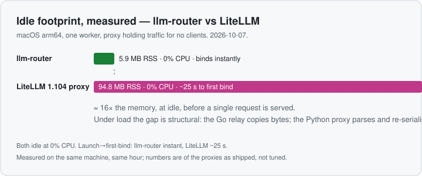

# llm-router

A small proxy that speaks **OpenRouter's wire format to the client** and its own
to each upstream. One model name, several interchangeable providers, and the
caller never learns which one served it.

```
agent ──POST /api/v1/chat/completions {"model":"anthropic/claude-opus-5.5"}──▶ llm-router
                                                        ├─ openrouter  anthropic/claude-opus-5.5  (weight 1)
                                                        └─ anthropic   claude-opus-5-5            (weight 0, failover only)
```

Point a client at `http://127.0.0.1:8787/api/v1` instead of
`https://openrouter.ai/api/v1`. Same paths, same `Authorization: Bearer`, same
`anthropic/claude-*` model strings. The alias names in `router.yaml` *are*
OpenRouter's, so nothing else on the client changes.

**Documentation: https://richardrh.github.io/llm-router/** — the README below is
the same material, formatted as a browsable site with [Hextra](https://imfing.github.io/hextra/).

The alias is yours to define, and each upstream keeps its own real model id —
which is the point: `anthropic/claude-opus-5.5` is what OpenRouter calls it,
`claude-opus-5-5` is what the Claude API calls it, and the router is where that
difference lives. When a provider is down, throttled, or saturated, the request
moves on without the agent noticing.

## Why llm-router

One narrow job — *rewrite one alias into different upstream model ids, spread
across providers, fail over* — done by a single static Go binary instead of a
control plane.

### LiteLLM vs llm-router

| | llm-router | LiteLLM |
| --- | --- | --- |
| Licence | none published yet | MIT |
| Performance | one ~17 MB static binary; measured idle at 5.9 MB RSS, 0% CPU, binds instantly | litellm 1.104 proxy measured idle at 94.8 MB RSS across its two processes, ~25 s from launch to first bind; a Python dependency tree spanning boto3, azure-*, polars, rq, redis and cryptography |
| Security | constant-time key check, inbound credentials stripped, secrets in env, cli upstreams store nothing, no bodies in logs — details below | boots only with a `LITELLM_MASTER_KEY`; virtual keys, budgets and teams need a Postgres database — a second credential store to run and protect |
| Alias → several providers | per-target model ids, weights, weight-0 failover-only targets | `model_name` with multiple deployments, weights and fallbacks |
| Wire translation | OpenAI Chat ↔ Anthropic Messages in both directions, streams translated incrementally without buffering | serves the OpenAI format and converts to provider SDKs; passthrough routes for some providers |
| Usage accounting | a SQLite file, one row per request, queryable over `/usage` with no database server | spend tracking through its database or external callbacks |
| Control plane (keys, budgets, teams, UI) | deliberately none | a core feature |

Both were measured idle on the same machine (macOS, arm64, one worker): llm-router
5.9 MB RSS, LiteLLM 94.8 MB — about 16× — and LiteLLM took 25 s to start serving
against llm-router's instant bind. CPU was 0% for both while idle. Under load the
difference is structural: the Go relay copies bytes; the Python proxy parses and
re-serialises.



| Measured, idle (macOS, arm64, one worker) | llm-router | LiteLLM 1.104 proxy |
| --- | --- | --- |
| Idle RSS | 5.9 MB | 94.8 MB (parent + uvicorn worker) |
| Idle CPU | 0% | 0% |
| Launch → first bind | instant | ~25 s |

The verdict: if you want provider breadth, virtual keys, budgets and a team
console, LiteLLM is the more complete product and is MIT-licensed — use it. If
you want one small proxy you can read in an afternoon and run anywhere, llm-router
is the smaller tool for that job.

### The others

- [new-api](https://github.com/QuantumNous/new-api) — closest off-the-shelf fit (per-channel `ModelMapping`, priority/weight failover), but AGPL-3.0 plus attribution terms, ~1.4k open issues, and a multi-tenant admin console.
- [bifrost](https://github.com/maximhq/bifrost) — permissive and well-run; routing keys off a model name its own catalog recognises, so "same alias, different model id per provider" has no field. Adaptive load balancing is Enterprise.
- [GoModel](https://github.com/ENTERPILOT/GoModel) — right design (`virtual_models`, weights, affinity); still 0.1.x.
- [llm-gateway](https://github.com/genai-io/llm-gateway) — most on-point config of anything surveyed; 0 stars, 9 commits.
- Rust options (gproxy, oxllm, litellm-rs, the `llm_router` crate) — no tenure yet.

### Security

What the code does, verified:

- **Constant-time gateway key check.** `crypto/subtle.ConstantTimeCompare` in `internal/router/server.go`, applied to inference and `/usage` alike.
- **Client credentials are never relayed.** Inbound `Authorization`, `x-api-key` and `api-key` are dropped before dispatch; the target gets only its own configured key. An Anthropic-wire client's Claude key never reaches whichever provider the alias picks. Hop-by-hop headers are not forwarded.
- **Secrets live in the environment.** `apiKeyEnv` is preferred; no key is required in `router.yaml`. On Kubernetes they come from a Secret, not the ConfigMap.
- **cli upstreams store and proxy nothing.** A `kind: cli` upstream is rejected at load if it carries an `apiKey`. The unmodified Claude Code binary runs under your login and the router reads only its stdout — subscription credentials never pass through the proxy, which is also what Anthropic's policy requires.
- **Prompts stay off disk.** No request bodies in the logs.
- **Loopback by default.** Set `apiKey` before exposing the listener; the comparison is constant-time.

## Running llm-router

### From source

```bash
go build -o llm-router ./cmd/llm-router   # requires Go 1.26 or newer
export OPENROUTER_API_KEY=sk-or-...        # at least one provider
export ANTHROPIC_API_KEY=sk-ant-...

./llm-router -check                        # validate, print resolved routes
./llm-router                               # listen on 127.0.0.1:8787
```

Then talk to it exactly as you would to OpenRouter:

```bash
curl http://127.0.0.1:8787/api/v1/chat/completions \
  -H "Authorization: Bearer $OPENROUTER_API_KEY" \
  -H 'Content-Type: application/json' \
  -d '{"model":"anthropic/claude-opus-5.5","messages":[{"role":"user","content":"hi"}]}'
```

`apiKey: ""` in the config accepts any credential, so the header only has to be
present for clients that insist on sending one.

Responses carry the routing decision:

```
X-Router-Upstream: openrouter
X-Router-Upstream-Model: anthropic/claude-opus-5.5
```

### Docker

The binary is static (the SQLite driver is pure Go), so the image is a
multi-stage build onto a distroless base: no shell, no package manager, running
as `nonroot`. Only the config is mounted; keys come in through the environment.

```bash
docker build -t llm-router .
docker run --rm -p 8787:8787 \
  -v "$PWD/router.yaml":/etc/llm-router/router.yaml:ro \
  -e OPENROUTER_API_KEY -e ANTHROPIC_API_KEY \
  llm-router -config /etc/llm-router/router.yaml
```

`docker run` never creates files it wasn't given, so with the usage store on a
bind-mounted file (`store.path`) the SQLite history survives the container.

### Kubernetes

`deploy/kubernetes.yaml` ships a working minimal config (one alias served by
OpenRouter), a Deployment and a Service:

```bash
kubectl apply -f deploy/kubernetes.yaml
kubectl create secret generic llm-router-keys \
  --from-literal=OPENROUTER_API_KEY=sk-or-...
kubectl port-forward svc/llm-router 8787:8787
# now the curl from "From source" works against 127.0.0.1:8787
```

For the full multi-provider config, replace the ConfigMap with your own
`router.yaml`:

```bash
kubectl create configmap llm-router-config \
  --from-file=router.yaml --dry-run=client -o yaml | kubectl apply -f -
```

Two constraints are load-bearing, both stated in the manifest: the usage store
lives on an `emptyDir`, so it dies with the pod unless you swap in a PVC; and
keep `replicas: 1`, because each replica keeps its own SQLite file, session pins
and cache-affinity observations — running several would fork the accounting and
the pinning without any of them being wrong.

To be precise about "Kubernetes-native": there is no operator, no CRDs, no
HPA — `replicas: 1` is a real constraint, not a placeholder. What makes it fit
the platform is what it does not need: no database, no sidecar, no service mesh,
one static binary probing on `/healthz`, config from a ConfigMap, keys from a
Secret. `kubectl apply -f` and it runs.

To publish the image the manifest expects:

```bash
docker tag llm-router ghcr.io/<your-user>/llm-router:latest
docker push ghcr.io/<your-user>/llm-router:latest
# and update image: in deploy/kubernetes.yaml to match
```

### Credentials

An **http** upstream authenticates with an API key, taken from the environment
(`apiKeyEnv`) or a literal in the config. A **cli** upstream (`kind: cli`) has no
credential at all: it runs a local command that manages its own login.

**Subscriptions cannot be replayed from a proxy, but they can be used through
one.** The distinction matters.

- Anthropic's [Claude Code
  policy](https://code.claude.com/docs/en/legal-and-compliance#authentication-and-credential-use)
  states that developers "may not collect, store, or intermediate Claude.ai
  credentials or session tokens", and that sign-in "must complete through
  Anthropic's own flow". A proxy holding your OAuth token does exactly the
  forbidden thing — and would additionally have to impersonate the CLI
  (`user-agent: claude-cli/…`, `x-app: cli`, the `You are Claude Code…` system
  prompt), because the API rejects those tokens without it.
- The same policy expressly does **not** prevent "an end user signing in to the
  unmodified Claude Code binary with their own Claude subscription".

So the router supports the second shape and refuses the first. Point a
`kind: cli` upstream at the real binary: it runs under your login, and the router
sees only its stdout — never a token, a credential file, or a keychain entry. A
cli upstream carrying an `apiKey` is rejected at load, because there is nothing
to give it.

```yaml
upstreams:
  claude-code:
    kind: cli
    mode: persistent
    command: [claude, -p, --input-format, stream-json,
              --output-format, stream-json, --verbose,
              --include-partial-messages, --model, "{model}"]
    cwd: /path/to/project
    maxSessions: 2
    sessionIdleTimeout: 30m
```

The persistent mode keeps one unmodified Claude Code process per client
session. It sends later turns through Claude Code's stream-JSON stdin protocol,
so Claude Code retains its normal system prompt, `CLAUDE.md`, hooks, skills,
plugins, MCP servers, tools, subagents and subscription login. The client must
send a stable session header such as `X-OMP-Session`; when absent, the router
derives a key from the conversation prefix.

The `model` target is substituted when the process starts. A session cannot
change models midway. `cwd` controls which project configuration Claude Code
loads. Do not use `--bare` when subscription login and normal project behavior
are required.

The older one-shot CLI mode remains available with a `{prompt}` placeholder,
but it flattens the request and starts a fresh process per turn. Persistent
mode is the normal Claude Code agent path. Client-supplied `tools` are not
forwarded: Claude Code owns the tools and executes them inside its process.

For an ordinary completion API, use an [OpenRouter](https://openrouter.ai/keys)
key for the one-endpoint many-provider case, or an Anthropic Console key for
Claude direct.

## Pointing clients at it

**Any OpenRouter client.** Change the base URL and nothing else:

```bash
export OPENAI_BASE_URL=http://127.0.0.1:8787/api/v1   # was https://openrouter.ai/api/v1
```

**omp / pi.** In `~/.omp/agent/models.yml`, use `discovery.type: litellm` so
context windows and pricing come from `/model_group/info` rather than a guess:

```yaml
providers:
  my-router:
    baseUrl: http://127.0.0.1:8787/api/v1
    apiKey: ROUTER_KEY          # only if `apiKey:` is set in router.yaml
    authHeader: true
    api: openai-completions
    disableStrictTools: true
    discovery:
      type: litellm
```

Aliases then appear as `my-router/anthropic/claude-opus-5.5` and
`my-router/anthropic/claude-sonnet-5.5`:

```yaml
modelRoles:
  default: my-router/anthropic/claude-sonnet-5.5
  slow: my-router/anthropic/claude-opus-5.5
```

**Anthropic-wire clients** (Claude Code, the Anthropic SDKs) point
`ANTHROPIC_BASE_URL=http://127.0.0.1:8787` and use the bare alias
`claude-opus-5-5`. The router forwards those to Claude's native `/v1/messages`.

## Configuration

`router.yaml` is the whole config, commented and ready to run. The keys worth
knowing:

| Key | Meaning |
| --- | --- |
| `listen` | Bind address. Loopback by default. |
| `apiKey` | Shared secret clients must present. `""` accepts any. |
| `defaults.*` | Retry budget, timeouts, sticky affinity, breaker thresholds. |
| `store.path` | SQLite file for usage history. Empty keeps no history. |
| `store.queueSize` | Records waiting to be written before they are dropped. |
| `store.maxRows` | Records kept, oldest deleted first. `0` keeps everything. |
| `upstreams.<name>.baseUrl` | Provider root; the protocol's path is appended. |
| `upstreams.<name>.apiKeyEnv` | Env var holding the key. Preferred over `apiKey`. |
| `upstreams.<name>.kind` | `http` (the default) or `cli`. |
| `upstreams.<name>.command` | argv for a `cli` upstream; must contain `{prompt}` exactly once. |
| `upstreams.<name>.timeout` | Bounds one `cli` invocation. Defaults to `maxStreamDuration`. |
| `upstreams.<name>.authStyle` | `bearer` (the default) or `anthropic`. |
| `upstreams.<name>.headers` | Extra headers per upstream, overriding the client's. |
| `upstreams.<name>.bodyDrop` | Top-level JSON fields removed before dispatch. |
| `upstreams.<name>.bodyPatch` | Top-level JSON fields forced. |
| `upstreams.<name>.maxConcurrency` | In-flight cap. At the limit: skipped, never queued. |
| `models.<alias>.api` | Wire protocol clients speak for this alias. |
| `models.<alias>.targets[]` | `{upstream, model, weight}` attempts, in order. |
| `models.<alias>.targets[].bodyPatch` | Top-level body fields set for that target only, applied after the upstream's. |
| `models.<alias>.targets[].bodyDrop` | Top-level body fields removed for that target only. |
| `models.<alias>.contextWindow`, `maxOutputTokens`, `cost` | Advertised to clients for budgeting; not enforced upstream. |

**`authStyle`.** `bearer` sends `Authorization: Bearer <key>`, which is what
OpenRouter and most gateways want. `anthropic` additionally sends `x-api-key`
and an `anthropic-version` header: Claude's native `/v1/messages` reads the
former and rejects requests without the latter. Pin a different API version by
setting `anthropic-version` under that upstream's `headers:`.

**One upstream, two wires.** Claude exposes `/v1/messages` natively and an
OpenAI-compatible `/v1/chat/completions` under the same base URL, so a single
`anthropic` upstream backs client aliases of either protocol.

**Configuration is checked against a model capability table.** `internal/config/capabilities.json`
is an embedded snapshot of the Claude models' limits, pricing and capability
flags, transcribed from the providers' published figures and cross-checked
against LiteLLM's model map. Loading a config uses it two ways:

- **Warnings** — declared `contextWindow`, `maxOutputTokens` or `cost` that
  disagrees with the model's published figures. The table is a snapshot, so
  drift is reported and never fatal, and the YAML stays the source of truth.
- **Errors** — a `bodyPatch` asking for something the model rejects, such as
  `thinking: {type: adaptive}` on Haiku 4.5, `thinking: {type: enabled}` on Opus
  5.5, or `output_config.effort` on a model without it. Those are guaranteed
  provider 400s, and failover cannot help.

A model the table does not know is never an error: there is simply nothing to
check. Model ids are normalised, so `anthropic/claude-opus-5.5`,
`anthropic/claude-opus-5.5:nitro`, `~anthropic/claude-opus-latest` and
`claude-opus-5-5` all resolve to the same entry. Capability flags are also
reported through `/model_group/info`, so a client can see what it may ask for
before sending a request.

**Weights.** Positive weights share traffic in proportion. `weight: 0` means
failover-only: never selected while a weighted target is healthy, but used when
they are not.

**Ordering under failure.** When every weighted target is down, the router
prefers a weighted target that is still reachable, then any reachable target
(including a failover-only one), and only then a target it already knows is
dead. A parked upstream is not retried until its cooldown expires, and then only
one request is admitted as a recovery probe.

## Choosing a model version, provider and thinking mode

These are set per **target** — per provider route — because the same logical
model needs different fields on each:

| What you want | Where |
| --- | --- |
| Which model version or variant | `targets[].model` |
| Which provider serves it | `targets[].bodyPatch` — OpenRouter's `provider` object |
| How hard it thinks | `targets[].bodyPatch` — `reasoning` on OpenRouter, `thinking`/`output_config` on Claude |
| A field a provider must not receive | `targets[].bodyDrop` |

**Version** is just the model id sent upstream, so adding one needs no router
change — add a target, or a whole alias, per variant. Pinned OpenRouter slugs
(`anthropic/claude-opus-5.5`), OpenRouter variants (`:nitro`, `:floor`,
`~anthropic/claude-opus-latest`), Claude's own ids (`claude-opus-5-5`) and dated
snapshots (`claude-haiku-4-5-20251001`) all work unchanged.

**Which OpenRouter provider** serves a request is the `provider` object:
`order`/`only`/`ignore` select providers by slug, `allow_fallbacks` decides
whether OpenRouter may fall back to another, and `sort`, `require_parameters`,
`data_collection`, `zdr` and `max_price` constrain the choice further.

**Thinking** is where the vocabularies genuinely diverge, and the router does not
translate between them:

```yaml
targets:
  - upstream: openrouter                  # OpenRouter's normalised controls
    model: anthropic/claude-opus-5.5
    bodyPatch:
      reasoning: { effort: high }
      provider: { order: [anthropic], allow_fallbacks: true }
  - upstream: anthropic                   # Claude's own fields
    model: claude-opus-5-5
    bodyPatch:
      thinking: { type: adaptive, display: summarized }
      output_config: { effort: xhigh }
```

**Thinking configuration is version-dependent, and a wrong value is a 400, not a
silent downgrade.** On Opus 5.5, Sonnet 5.5 and Fable 5.1 thinking is always on
and adaptive: send `{type: adaptive}`, and `{type: enabled, budget_tokens: N}` is
rejected. Haiku 4.5 and the 4.5-generation models are the inverse — `adaptive` is
rejected there and the explicit `{type: enabled, budget_tokens: N}` is what
works. That divergence is precisely why `bodyPatch` is a pass-through and there
is no `thinking: high` shorthand: no single vocabulary is right for every model.

Patches **replace** the top-level key rather than merging into it, so if the
config names `provider`, its value is exactly what the upstream receives. Target
shaping is applied after the upstream's, so a target overrides an upstream
default. Claude's OpenAI-compatibility layer accepts `thinking` but documents
`reasoning_effort` as ignored, and does not accept `output_config` — effort
control belongs on the native `/v1/messages` aliases.

## Translating between wires

A target may name a different wire protocol than its alias. The router then
translates the request on the way out, and the response and its stream on the way
back:

```yaml
models:
  anthropic/claude-opus-5.5:
    api: openai-completions        # what clients speak
    targets:
      - upstream: openrouter
        model: anthropic/claude-opus-5.5
        weight: 1
      - upstream: anthropic
        model: claude-opus-5-5
        weight: 0
        api: anthropic-messages    # what this upstream speaks
```

Two pairs are bridged, in either direction: OpenAI Chat Completions to and from
Anthropic Messages. Anything else is refused at startup. With no `api:` on a
target, nothing is translated and the relay stays byte-transparent.

**Shaping happens after translation**, so `bodyPatch` and `bodyDrop` on a
translating target speak the upstream's vocabulary — the native Anthropic target
above takes `thinking: {type: adaptive}`, not an OpenAI approximation of it. The
capability checks validate those patches against the same model facts.

**What is mapped:** messages (leading system messages hoisted to `system`, later
ones folded into the conversation, consecutive turns coalesced, assistant
`tool_calls` to `tool_use` blocks, `role: tool` results to `tool_result` blocks,
`image_url` to image blocks), tools and `tool_choice`, `max_tokens` (defaulted to
4096, which the Messages API requires), `stop` to `stop_sequences`, and the
reasoning controls in both directions. Responses map content blocks back, convert
`stop_reason` to `finish_reason` and back, and normalise usage including cache
reads and writes.

**What is not:** native structured outputs, citations, computer use, server-side
tools and PDF input. Fields with no equivalent are dropped rather than guessed
at, because the Messages API rejects unknown parameters instead of ignoring them.

Streaming is translated incrementally with no whole-stream buffering, and the
usage observer still reads the upstream's own events — so accounting works
identically whether or not the wire changed.

## Usage history

Point `store.path` at a file and the router keeps a row per served request: the
alias, the upstream that answered, the tokens, the latency and the cost.

```yaml
store:
  path: ~/.llm-router/usage.db
  queueSize: 1024
  maxRows: 130000        # about 10 MB, keeping the newest 130k requests
```

Read it back through the router, with the same credential inference uses:

```bash
curl -H "Authorization: Bearer $ROUTER_KEY" \
  'http://127.0.0.1:8787/usage?group_by=alias&since=7d'
```

| Query | Meaning |
| --- | --- |
| `/usage` | the 100 most recent requests |
| `/usage?group_by=alias` | totals per alias, most expensive first |
| `/usage?since=7d&alias=…` | a window, filtered |
| `/usage?upstream=openrouter` | one provider |
| `/usage?limit=500` | more rows (max 1000) |

`since` and `until` accept an RFC3339 timestamp or a duration (`30m`, `24h`,
`7d`). `group_by` accepts `alias`, `upstream`, `upstream_model` and
`cost_source`. The response reports the window's totals alongside the rows or
the groups, so a client does not have to add them up.

Or skip the router entirely — it is an ordinary SQLite file, and any client will
do, from the `sqlite3` CLI to Datasette:

```sql
SELECT upstream, count(*), sum(cost_usd) FROM requests GROUP BY 1;
```

**This is history, not enforcement.** Nothing here caps or refuses spend; it
records it. Budgets, keys and tenancy are a control plane, and deliberately
absent.

Five properties are worth knowing:

- **Retention is a ring.** Records are pruned as they are written — within one
  flush, so a quarter of a second — anything older than the newest `maxRows`
  being deleted. It is a row budget rather than a byte budget because a row count
  is exact and predictable, and these rows are near-uniform at about 80 bytes, so
  `maxRows: 130000` holds the table near 10 MB; `/usage` reports the real
  `size_bytes` under `store` so the number can be tuned against a measurement
  rather than a guess. Deleting does not shrink the file, because SQLite keeps
  freed pages and reuses them — the file plateaus at the cap, which is what a
  ceiling is for. The write-ahead log is bounded too, checkpointed every 64 pages
  instead of the default 1000: left at the default it reached 3.7 MB against a
  4 KB database, and now settles near 256 KB. `maxRows: 0` — the default — keeps
  everything.

- **A request whose provider reported nothing stores NULL, not zero.** The token
  columns are nullable precisely so that `SUM` cannot count spend that was never
  measured; `/usage` reports those requests separately under `unreported`.
- **Writing never applies back-pressure.** Records pass through a bounded queue
  to a single writer. If the disk cannot keep up they are dropped and counted in
  `dropped_records`, because accounting must never be the reason an inference
  call is slow, or the reason one fails.
- **The file is readable while the router runs.** WAL mode is on, which is also
  why `-wal` and `-shm` files appear beside it.
- **Only served requests are recorded.** When every target failed there is no
  usage, no cost and no upstream that answered, so that request is logged rather
  than stored.

## Design notes

**Failover happens strictly before the first response byte is committed.** The
request body is buffered (bounded by `maxBodyBytes`) so it can be replayed
against the next target. Once a status line is written, the response belongs to
the client: a truncated or failed stream is logged and returned, never
re-dispatched, because the client cannot un-see it.

**Retried statuses.** 429, 401, 402, 403, 5xx. Ordinary 4xx are the client's
bug and are returned unchanged instead of being fired at every provider. A 429
parks the upstream without counting against its health — it is busy, not broken.

**Streaming is byte-transparent.** No parsing, no re-serialisation: tool-call
argument fragments and reasoning deltas pass through exactly as the upstream
emitted them, with a flush per chunk. The transport disables compression so the
SSE body is never buffered.

**Sticky affinity exists for prompt caching.** Successive turns of one
conversation are pinned to a single target so the provider's cache keeps
hitting. Worth knowing when reading `router.yaml`: Claude's
OpenAI-compatibility layer does not implement prompt caching, while OpenRouter's
Claude models do, so the OpenAI-wire aliases send traffic to OpenRouter first
and keep the direct Claude API as failover. The native `/v1/messages` aliases,
where caching works properly, go direct.

**Cache affinity makes that assumption observable.** A session pin is a guess
about where a cache lives. Cache affinity replaces the guess with evidence: the
usage reports from Phase 2 say whether a prefix was read from cache or written
to it, so the router records which upstream actually holds each conversation's
prefix, with a TTL matching the provider's own cache lifetime. When no pin
applies — a new session, or one whose target failed and was replaced — the
conversation goes back to the cache that holds it rather than to a weighted coin
toss. It is a preference, not a strategy: it only ever chooses among targets that
are already equally eligible, so it cannot override a pin, weights, or health.

**Usage on streams is only requested on the OpenAI wire.** `injectStreamUsage`
adds `stream_options`. The Anthropic Messages API has no such field and reports
usage in its own stream events, so the router never injects it there.

**Usage and cost are observed, not invented.** The relay feeds the bytes it has
already copied to a line-oriented observer, so token counts and cache reads are
recorded without parsing, buffering or rewriting the stream: the client still
receives the upstream's bytes exactly, terminator included. Both wires are
normalised, because they disagree — the OpenAI wire's `prompt_tokens` includes
cached tokens, while Anthropic's `input_tokens` excludes its separate cache
fields — so cache reads are never billed twice. Each served request logs
`input_tokens`, `output_tokens`, `cache_read_tokens`, `cache_write_tokens` and
`cost_usd` from the alias's declared rates. When a provider reports no usage, the
log says `usage=unreported` rather than claiming a spend that was never measured.

**Model rewriting is not applied to streams.** Rewriting JSON mid-stream would
mean parsing incremental structured data; the response headers carry
`X-Router-Upstream-Model` instead. Non-streaming responses have their `model`
field rewritten back to the alias so the client displays what it asked for.

**Client credentials never reach an upstream.** Inbound `Authorization`,
`x-api-key` and `api-key` are dropped and replaced with the target's own key, so
an Anthropic-wire client's Claude key is never relayed to whichever provider the
alias happens to pick. Hop-by-hop headers are not forwarded.

**The listener is loopback by default.** Set `apiKey` if anything else can reach
it; the comparison is constant-time.

## What this deliberately does not do

- **Translation is limited to two pairs.** A target may name a different wire
  than its alias: OpenAI Chat Completions to and from Anthropic Messages, in
  either direction. Every other combination is refused at startup rather than
  half-supported. An alias whose targets all share its wire stays a
  byte-transparent pass-through.
- **The translation covers what a coding agent needs, and no more.** Messages
  (system hoisting, role coalescing, tool calls and results, images), tools and
  tool choice, token limits, stop sequences and reasoning controls are mapped.
  Native structured outputs, citations, computer use, server-side tools and PDF
  input are not. Fields with no equivalent are dropped rather than approximated,
  because the Messages API rejects unknown parameters outright.
- **The compatibility layer is optional now.** Claude's OpenAI-compatibility
  layer supports tools and streaming but ignores `strict`, `reasoning_effort`
  and `response_format`, and does not implement prompt caching. Pointing a target
  at `api: anthropic-messages` reaches the native endpoint through the
  translator instead, so an OpenAI-shaped client can use Claude's own `thinking`
  and `output_config` controls.
- **No translation between reasoning vocabularies.** `reasoning` (OpenRouter) and
  `thinking`/`output_config` (Claude) are different fields with different accepted
  values, and they change with the model generation. The router forwards whatever
  each target's `bodyPatch` sets and never maps one provider's spelling onto
  another's — a mapping table would be wrong the moment a model version changed.
- **No `/v1/embeddings`, images, audio, or batch.** Unsupported endpoints return
  404 rather than being proxied blindly.
- **No request bodies in the logs.** Prompts and code stay out of your disk.
- **No prefix-similarity scheduling for self-hosted KV caches.** Cache affinity
  tracks which *provider* holds a warm prompt cache, learned from the usage it
  reports. It does not do prefix-tree matching across a fleet of self-hosted
  pods, where the cache lives in GPU memory and has to be probed quite
  differently.
- **`contextWindow` is advisory.** It tells the client how to budget its
  context. It does not stop an upstream from rejecting a longer prompt, and it
  does not make different upstreams behave identically — OpenRouter and the
  Claude API may serve a different revision, or apply different limits, under
  the same alias.

## Tests

```bash
go test -race ./...
```

Covers alias rewriting per target, weighted distribution, weight-0 failover-only
semantics, sticky affinity (with and without a client session header), breaker
rotation and single-probe recovery, pre-commit failover, no-failover on client
errors, SSE passthrough, credential scrubbing, Anthropic credential and version
headers, `stream_options` suppression on the Anthropic wire, the OpenRouter-shaped
`/api/v1` paths, per-target body shaping (divergent vocabularies in one request,
target-over-upstream precedence, per-target drops, and rejection of `model` in a
patch), the model capability table (parsing, id normalisation across provider
spellings, drift warnings, and rejection of thinking modes a model refuses),
usage accounting (per-wire token normalisation, incremental merging of an
Anthropic stream, byte transparency under observation, cost arithmetic, and an
explicit marker when a provider reports nothing), cache affinity (evidence-based
warmth tracking, TTL expiry, returning a conversation to the warm target over a
100:1 weight disadvantage, and inertness when disabled), wire translation in both
directions (system hoisting, role coalescing, tool-call and tool-choice mapping,
`max_tokens` defaulting, reasoning controls, response and usage mapping,
fragmentation-invariant streaming, and refusal of untranslatable pairs at load),
CLI-backed upstreams (prompt rendering from either content form, `{prompt}`
substitution and its error cases, incremental deltas from a real subprocess,
reported cost and usage, stderr surfaced on failure, context cancellation, plus
serving both wires through a command and refusing an `apiKey` on one), the usage
store (WAL actually applied through a URL-escaped DSN, a durable flush on close,
sub-second ordering and range filtering, NULL rather than zero for unreported
usage, grouped aggregates, refusal of a non-whitelisted group column,
drop-rather-than-block under a full queue, idempotent close, the row budget as a
ring across restarts, and inertness when disabled), the `/usage` endpoint
(report shapes, key enforcement, and rejection of bad windows, limits and group
columns), and the YAML-on-disk path through `LoadConfig`.